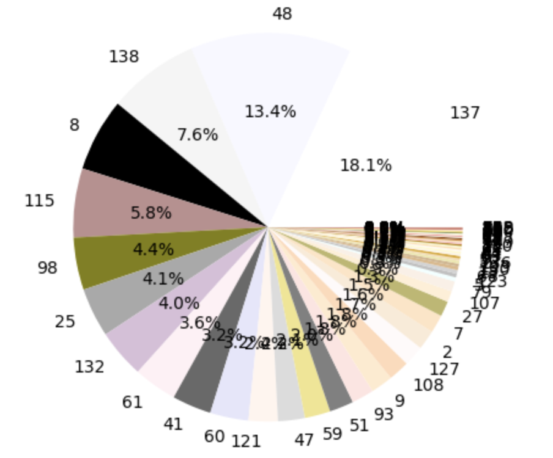
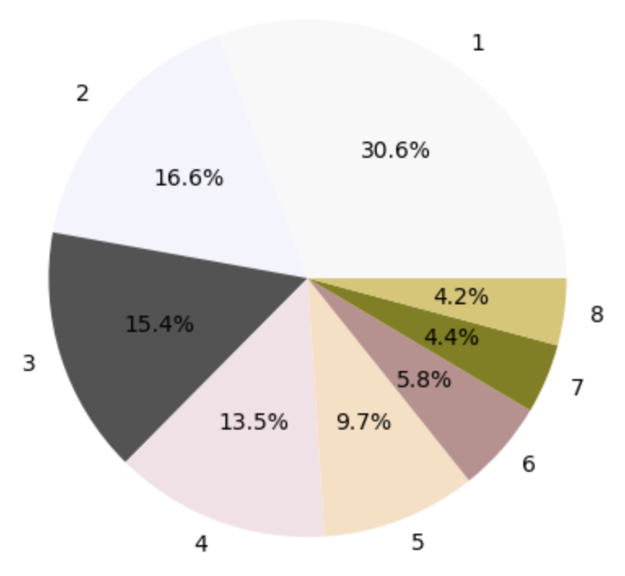

# color_summary
> 色彩空间为：HSV cone

## use

```shell
pip install git+https://github.com/WGS-note/color_summary.git
```

```python
from color_summary.color_extract import *
image = cv2.imread('./assets/d7-1.jpg')
```

色系提取：

```python
 '''   得到距离近的配色质心索引   '''
distance = get_color_distance(image, target=WEBCOLORS, color_convert=partial(bgr2hsvcone, r=10), blur_block=8)   # HSV cone

'''   得到embedding   '''
centroid_proportion = get_color_emb(distance)

color_img_show(centroid_proportion, colors=np.array(cv2.cvtColor(WEBCOLORS, cv2.COLOR_BGR2RGB)), save_path='./assets/clu_color_pie.jpg')
```



色系概述：

```python
'''   色系概述   '''
csy = ColorSummary(centroid_proportion, WEBCOLORS, num=8)
csy.merge_similar_colors(img_show=False)
color_summary_lst = csy.get_color_summary(webcolor_name=WEBCOLOR_NAME)
print(color_summary_lst)
```

```
[{'proportion': 0.30604938271604937, 'RGB': [248.69171036708352, 248.59792254941516, 248.59207341670034], 'name': {'en': 'whitesmoke', 'zh_cn': '烟白色'}, 'id': 137}, {'proportion': 0.16555555555555557, 'RGB': [244.53691275167787, 244.53691275167787, 254.03803131991052], 'name': {'en': 'ghostwhite', 'zh_cn': '幽灵白'}, 'id': 47}, {'proportion': 0.15419753086419755, 'RGB': [83.67253803042435, 83.67253803042435, 83.67253803042435], 'name': {'en': 'dimgray', 'zh_cn': '暗灰色'}, 'id': 40}, {'proportion': 0.13453703703703704, 'RGB': [242.85868318421655, 224.93966506079371, 230.61000229410413], 'name': {'en': 'lavenderblush', 'zh_cn': '淡紫红'}, 'id': 60}, {'proportion': 0.09685185185185186, 'RGB': [248.95697896749525, 223.01306564690887, 192.6370299553856], 'name': {'en': 'bisque', 'zh_cn': '桔黄色'}, 'id': 6}, {'proportion': 0.0575, 'RGB': [188.0, 143.0, 143.0], 'name': {'en': 'rosybrown', 'zh_cn': '褐玫瑰红'}, 'id': 114}, {'proportion': 0.04351851851851852, 'RGB': [128.0, 128.0, 0.0], 'name': {'en': 'oLivee', 'zh_cn': '橄榄色'}, 'id': 97}, {'proportion': 0.04179012345679012, 'RGB': [217.59896602658793, 198.80945347119646, 109.384047267356], 'name': {'en': 'khaki', 'zh_cn': '黄褐色'}, 'id': 58}]
```

画图：

```python
# '''   画图   '''
wei, cols = [], []
for cen in color_summary_lst:
    wei.append(cen['proportion'])
    cols.append(cen['RGB'])
color_img_show(np.array(wei), colors=np.array(cols), save_path='./assets/clu_color_pie.jpg')
```




## 算法描述

+ `色系提取`：检测图片，返回图片的Embedding表示（离散化）。

  + 利用移动窗口对图片进行滑动模糊处理，滑块大小为8*8，取窗口的均值作为模糊后的颜色值。[H//block, W//block, 3]
  + 将模糊后的图片与配色方案进行颜色空间的转换。
  + 计算图片像素与每个配色方案的欧式距离。[H//block * W//block, 140]
  + 对维度1取argmin，得到与图片像素相似的对应配色的索引。[H//block * W//block, ]
  + 计算配色方案中每个配色在图片像素中出现的占比，即为图片的离散化表示。[140, ]

+ `色系概述`：概述图片的主色，即合并同类色。

+ - 得到配色方案在输入图片中出现的占比后，忽略占比为0的，记为cen_prop。
  - 设定将图片概述为8个颜色，循环配色，两两进行合并，取合并后损失变化最小的作为当前轮的合并结果，直到满足条件。
  - 具体来说：

- - - 配色方案的占比可以作为权重，并且根据索引能够获得每个配色的RGB和HSVcone。
    - 定义一个簇心类 Cen，有元素xids（每个配色的索引）和方法__add__。
    - 设簇心个数为 C = len(cen_prop)。
    - 初始化簇心列表 cen_lst = [Cen(array([i])) for i in range(C)]。

- - - - while C > 8:

- - - - - for j in range(C):

- - - - - - for i in range(j + 1, C):

- - - - - - - i、j 两质心合并，得到新质心。新质心表示为，x为HSVcone，w为质心的占比。
            - △误差 = e_loss - j_loss - i_loss。误差表示为：
            - 判断△误差是否是最小，如果是则记录误差及(j, i)

- - - - - C -= 1
        - 原始cen_lst将 i、j 依次弹出，然后追加新质心

## 欢迎关注我的公众号


